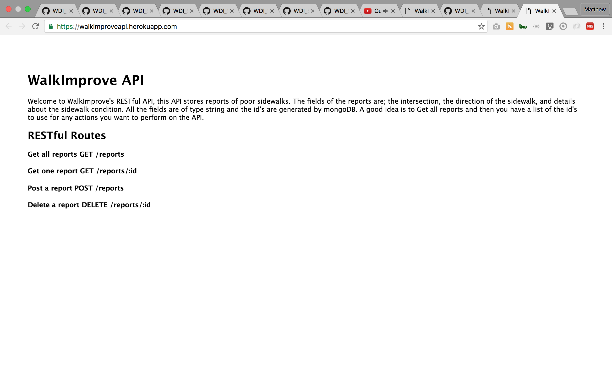

#WalkImprove API - A sidewalk condition reporting api

* This is a MEN stack RESTful API that takes stores reports regarding poor sidewalk conditions in Los Angeles

* Technologies used: MEN stack, Mongo, Express, Node, HTML, CSS, Javascript, jQuery, Heroku, and git.

* Approach taken: research well documented MEN stack RESTful api, review options, determine time frame of options and determine the most efficient approach. Then using Mongodb, express and node express generate a new application then customize the configuration for sidewalk reports.

* Install instructions: git clone https://github.com/matthewbrozen/walkimproveapi, $ npm install, touch .env, add backend url and token secret, touch a Procfile with web: node bin/www inside, start nodemon.

* Unsolved Problems: Authentication and authorization using JWT and passport.

* RESTful Routes
  Get all reports GET /reports
  Get one report GET /reports/:id
  Post a report POST /reports
  delete a report DELETE /reports/:id

* Further Development: set up users and then associate users with their own posts and then allow users to only edit or delete their posts, RSS feed with construction news and a way to contact the elected representative of that area to complain.

#API Screen shot

#Project 4 Main Repo
[main repo](https://github.com/matthewbrozen/project4)  

#WalkImprove Front End Repo
[front end repo](https://github.com/matthewbrozen/walkimprovefrontend)
